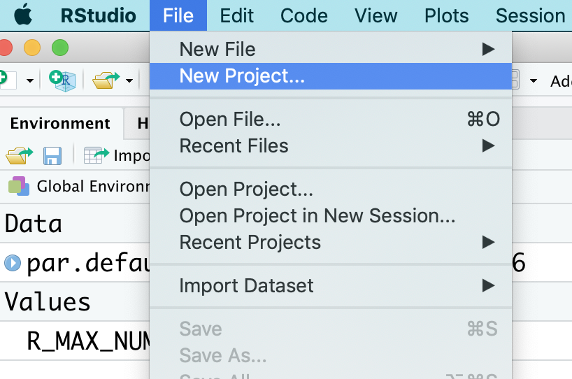
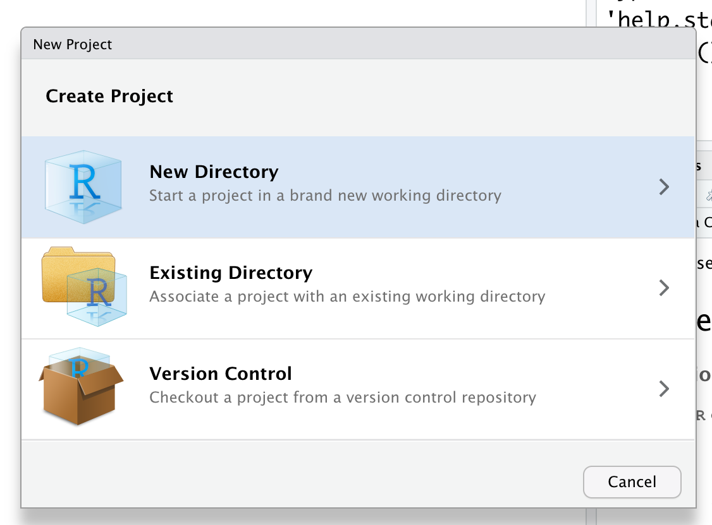
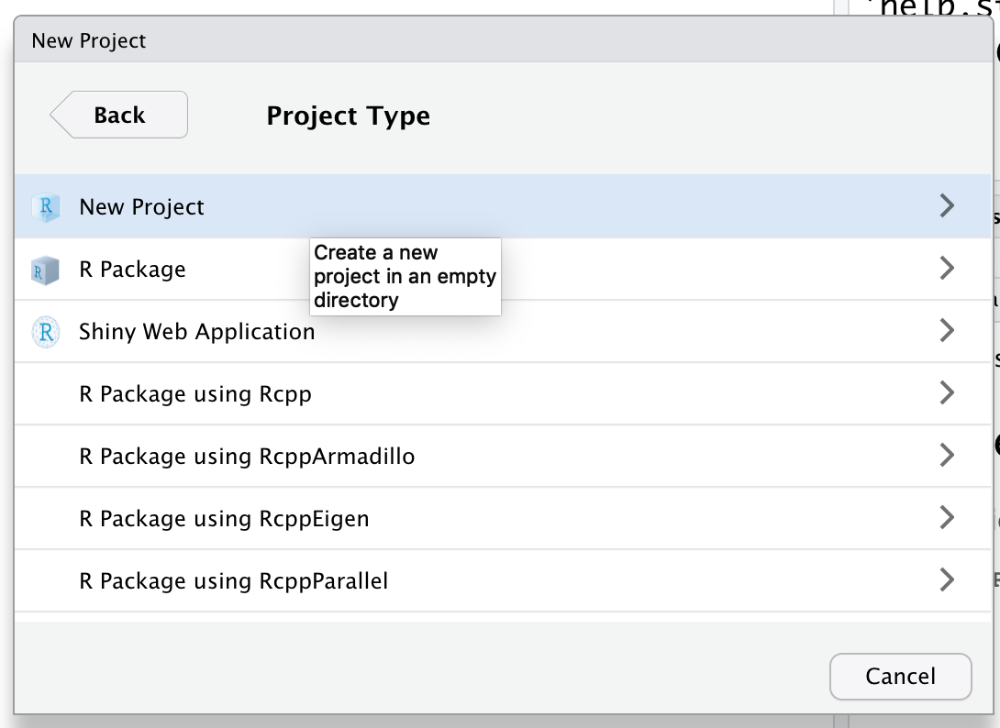
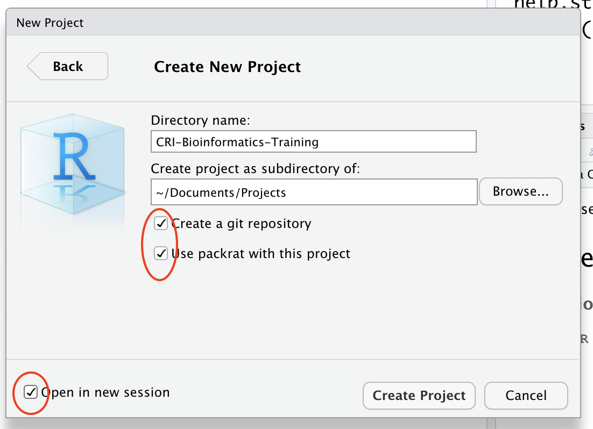
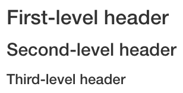

```{r global_options, include=FALSE}
knitr::opts_chunk$set(echo = TRUE)
```

# Prerequisites

***
To use R Markdown in reproducible data analysis, we need to install the following software in our computer:

* Latest R 3.5.2 release <https://cran.r-project.org/>  
* RStudio Desktop <https://www.rstudio.com/products/rstudio/download/#download>
  - If you are an adventurer, try RStudio Preview <https://www.rstudio.com/products/rstudio/download/preview>  
* pandoc <https://pandoc.org/installing.html>
* git <https://git-scm.com> 

In this training, we are going to use a reproducible package management tool **packrat**. If you have not done so, please first install the package using `install.packages("packrat")` command in R console, then restart RStudio. From now on, any new R packages will be installed in `packrat` directory (**private package library**) within the project folder. This makes the your project more isolated, portalbe, and reproducible.

**Always create a project for your data analysis in RStudio**

{ width=50% }.
{ width=50% }.
{ width=50% }.
{ width=50% }.

We also need to install some packages. 

```{r r_packages, eval=TRUE, message=FALSE, results='hide'}
prerequisites <- c("rmarkdown", "knitr", "here", "tidyverse", "kableExtra",  
                   "captioner", "jsonlite", "xml2", "httr", "rnoaa")
packages_installed <- installed.packages()
missing_packages <- prerequisites[!prerequisites %in% packages_installed]
if(!identical(missing_packages, character(0))){
     install.packages(missing_packages, repos = "https://cran.rstudio.com")
}

sapply(prerequisites, library, character.only = TRUE)
```

For PDF output, install \( \LaTeX \)  <https://www.latex-project.org/get/> or $TinyTeX$ <https://yihui.name/tinytex/>  

```{r install_tinytex, eval=FALSE}
## Not run
install.packages("tinytex")
# The following command installs a custom LaTeX distribution based on TeX Live that is small in size (150Mb on macOS/Linux and 220Mb on Windows).
tinytex::install_tinytex() 
```

For Microsoft Word output, install Microsoft Office.

**Lastly, copy the `src` folder downloaded from the github <https://bit.ly/2MPikd8> to the project directory.**

# R Markdown
***  
Markdown is a lightweight markup language with plain text formatting syntax for authoring HTML, PDF, and Microsoft Word documents. R Markdown is an extension of the markdown syntax. You can use a single R Markdown file to 

* integrate text, r code and its output  
* create high quality reports that can be shared with others

## Basics
 
A minimal R Markdown file contains **3** basic components: the metadata, text, and code.

### Meta data
***  
The metadata is written between a pair of three dashes `---`. The syntax for the metadata is called YAML <https://en.wikipedia.org/wiki/YAML>. Remember the indentation matters in YAML format, so do not forget to indent the sub-fields of a top field properly.

```yaml
---
title: "Sample Document"
author: "Someone"
date: "2019-02-07"
output: html_document
---
```

### Text and code
***  
````markdown
This is a paragraph in an R Markdown document.

Below is a code chunk:

```{r}`r ''`
fit <- lm(dist ~ speed, data = cars)
b   <- coef(fit)
plot(cars)
abline(fit)
```
````

````markdown
The slope of the regression is `r knitr::inline_expr('b[1]')`.
````

## Markdown syntax

### Inline formatting
***  
* Bold **text** can be produced using a pair of double asterisks(`**text**`)

* Italic *text* can be generated with either `_text_` or `*text*`

* For superscript, use a paire of carets (^), e.g., `Ca^2+^` renders Ca^2+^ and `O^2-^` renders O^2-^.
* For subscript, use a pair of tildes (~), e.g., `CO~2~` renders CO~2~ and `H~3~PO~4~` renders H~3~PO~4~.

* To mark text as `inline` code, use a pair of backticks, `` `inline` ``. To include $n$ literal backticks, use at least $n+1$ backticks around them, e.g. you need four backticks to surround three backticks inside in order to render ````` ```` ```code``` ```` `````, which is shown as ```` ```code``` ````.

* To create hyperlinks, use the syntax`[text](link)`, e.g., `[University of Chicago](https://www.uchicago.edu)` renders [University of Chicago](https://www.uchicago.edu). 

* To insert an image, use the syntax``, e.g.,  
`{ width=10% }`. 

{ width=10% }


### Block-level elements  
***
To add section headers, put `#` at the begining of a line, followed by a space and some header text, e.g., 

```markdown
# First-level header

## Second-level header

### Third-level header
```

renders



### List
***
Unordered list items start with *, +, or -, and you can nest one list within another list by indenting the sub-list, e.g.,

```markdown
- item one 
- item two 
- item three  
    - sub-item one  
    - sub-item two  
```
renders

- item one
- item two
- item three
    - sub-item one
    - sub-item two

***
Ordered list items start with numbers or `(@)`. You can also nest lists within lists or mix ordered lists with unordered lists, e.g.,

```markdown
1. item one 
2. item two 
3. item three  
    - sub-item one  
    - sub-item two  
```
and 

```markdown
(@) item one 
(@) item two 
(@) item three  
    - sub-item one  
    - sub-item two  
```
both render

1. item one 
2. item two 
3. item three  
    - sub-item one  
    - sub-item two  
    
### Quotation 
***
How do you quote somebody's words? 

```markdown
> "Remember that all models are wrong; the practical question is how wrong do they have to be to not be useful."  
>  
>  
> --- George Box & Norman Draper

```

> "Remember that all models are wrong; the practical question is how wrong do they have to be to not be useful."  
>  
> --- George Box & Norman Draper

### Code blocks  
***
Plain code blocks can be written after three or more backticks, and you can also indent the blocks by four spaces, e.g.,
````markdown
```
This text is displayed verbatim / preformatted
```
Or indent by four spaces:

    This text is displayed verbatim / preformatted
````

```
This text is displayed verbatim / preformatted
```

    This text is displayed verbatim / preformatted
    
***
What do you expect from the following lines:

```markdown
In R, the character  
# indicates a comment.

and 

In R, the character

# indicates a comment.
```

As a good practice, leave at least one empty line between adjacent but different elements, e.g., a header and a paragraph to avoid ambiguity to the Markdown renderer. If your text starts with a `#`, you can escape the sign as below:

```markdown
\# indicates a comment.
```

\# indicates a comment.

### Math expression
***   
Inline \( \LaTeX \) math formulas can be written in a pair of **`$`** signs, e.g., `$y = ax + b$` renders $y = ax + b$. Or `$$f(k) = {n \choose k} p^{k}(1-p)^{n-k}$$`, and the output looks like this:  

$$f(k) = {n \choose k} p^{k}(1-p)^{n-k}$$

You can also use math environments inside `$ $` or `$$ $$` to render a more complex example:

```markdown
$$\begin{vmatrix}a & b\\
c & d
\end{vmatrix}=ad -bc$$
```
$$\begin{vmatrix}a & b\\
c & d
\end{vmatrix}=ad -bc$$

## R code chunks
***  
You can insert code chunks using:

  - the keyboard shortcut Ctrl + Alt + I (OS X: Cmd + Option + I)  
  - the Add Chunk command in the RStudio toolbar  
  - the chunk delimiters ```` ```{r} and ``` ````.  


````markdown
```{r}`r ''`
# execute code if the date is newer than a specified day
do_it <- Sys.Date() > '2018-02-01'
print(do_it)
```
````

```{r}
# execute code if the date is later than a specified day
do_it <- Sys.Date() > '2018-02-01'
print(do_it)
```

A typical R code chunk looks like this

````markdown
```{r, chunk-label, results='hide', fig.height=4}`r ''`
```
````

You can find the details of the chunk options in __knitr__ document at <https://yihui.name/knitr/options>. A few most used options are listed below:

***
Option       | default  | effect  
-------------|----------|-----------
`eval`       | TRUE     | Whether to evaluate the code and include its results      
`echo`       | TRUE     | Whether to display code along with its results
`include`    | TRUE     | Whether to include anything from a code chunk in the output document
`warning`    | TRUE     | Whether to disply warnings 
`message`    | TRUE     | Whether to display messages
`error`      | FALSE    | Whether to display errors          
`tidy`       | FALSE    | Whether to reformat code in a tidy way when display it
`results`    | markup   | How to display the results          
`cache`      | FALSE    | Whether to cache results for future renders   
`comment`    | `##`     | Comment character to preface results with
`fig.show`   | hide     | Whether to display the plots created in chunk     
`fig.width`  | 7        | Width in inches for plots created in chunk
`fig.height` | 7        | Height in inches for plots created in chunk  
***

If you frequently use certain option, you can consider setting it globally in the first code chunk of your document, e.g.,

````markdown
```{r, setup, include=FALSE}`r ''`
knitr::opts_chunk$set(fig.width = 8, collapse = TRUE)
```  
````

##  Inline R code
***  
Besides code chunks, you can also insert values of R objects inline in text. For example:

````markdown
```{r}`r ''`
x = 5  # radius of a circle
```

For a circle with the radius `r '\x60r x\x60'`, its area is `r '\x60r pi * x^2\x60'`.
````

```{r}
x = 5  # radius of a circle
```

For a circle with the radius `r x`, its area is `r pi * x^2`.

## Figures
***  
By default, figures produced by R code will be placed immediately after the code chunk they were generated from.

````markdown
```{r}`r ''`
plot(cars, pch = 18)
```
````

```{r}
plot(cars, pch = 18)
```  

***  
You can change the figure layout in the R code chunk to display two plots side-by side. Be sure to set `fig.show='hold',` in the chunk options:

```{r hold-position, fig.cap='Figure: two plots side-by-side.', fig.show='hold', out.width='50%', fig.width=5, fig.height=4}
par(mar = c(4, 4, 0.2, 0.1))
plot(cars, pch = 19)
plot(pressure, pch = 17)
```  

***  
If a figure is generated from other tools, you can also insert it to the markdown file.

````markdown
`r ''````{r, out.width='10%', fig.align='center', fig.cap='The University of Chicago Shield', fig.align='center'}
knitr::include_graphics('logo.png')
````

```{r include-graphics, echo=FALSE, fig.cap='The University of Chicago Shield', out.width='10%', fig.align='center'}
knitr::include_graphics(here("src/img", "logo.png"))
```

## Table
***  
There are two approaches to include tables in the R markdown file. 

1. Create table using ASCII.

| Name | Height | Weight |
|------|--------|--------|
| Bob  | 6'1"   | 195    |
| Sue  | 5'4"   | 134    |
***  

2. Use R code chunk

By default, R Markdown prints data frames and matrices as you'd see them in the console:

```{r}
mtcars[1:5, ]
```

***  
If you prefer that data be displayed with additional formatting you can use the `knitr::kable` function. 

```{r kable}
knitr::kable(
  mtcars[1:5, ], 
  table.attr = "style='width:80%'", 
  caption = "A table generated by kable function from knitr package"
)
```

Read the documentation for `?knitr::kable` to see the other ways in which you can customise the table. For more complex customization, take a look at the __kableExtra__, __xtable__, __stargazer__, __pander__, __tables__, and __ascii__ packages. Each provides a set of tools for returning formatted tables from R code.


## Cross-reference
***  
To cross-reference a table or figure in the text, we need R package ```captioner``` which we have previously installed. We also define a few functions in a setup chunk,

```markdown
table_nums <- captioner::captioner(prefix = "Table")  
fig_nums <- captioner::captioner(prefix = "Figure")
f_ref <- function(x) {
  stringr::str_extract(table_nums(x), "[^:]*")
}
```

```{r cross_ref_setup, include=TRUE}
table_nums <- captioner::captioner(prefix = "Table")
fig_nums <- captioner::captioner(prefix = "Figure")
f_ref <- function(x) {
  stringr::str_extract(table_nums(x), "[^:]*")
}
```

To cross-reference a table, we first give a name to the table.

```{r}
tab.1_cap <- table_nums(name = "tab_1", caption = "A table generated by kable function from knitr package")
```

add a title to the table using inline R code `r '\x60r table_nums("tab_1")\x60'`, and call `r '\x60knitr::kable()\x60'` function in a code chunk, then refer the table using inline R code `r '\x60r f_ref("tab_1")\x60'`.


`r table_nums("tab_1")`

```{r kable2, fig.cap=table_nums(name = "tab_1", caption = "A table generated by kable function from knitr package")}
knitr::kable(mtcars[1:5, ], table.attr = "style='width:80%'")
```  


***

Here we refer to the table, *`r f_ref('tab_1')`* is shown above.


Figures can also be cross-referenced similarly.


**Note**: [bookdown](https://cran.rstudio.com/web/packages/bookdown/index.html) package provides an easier way to cross-reference table or figure. Check out <https://bookdown.org/yihui/bookdown/cross-references.html> if you are interested.


## Troubleshooting R Markdown file

Knitting an R Markdown file is carried out in a different R session, separated from the interactive R envronment you currently have. This makes troubleshooting R Markdown errors a bit tricky. Nevertheless, following the rules below will help.

- If the errors are caused by the embeded R code, try to recreate the problem in an interactive session. Restart R, then "Run all chunks" from the manu or `Ctrl+Alt+R` (Windows) / `Ctrl+Option+R` (macOS).  
- Check your working directory. The working directory of an R Markdown is the directory in which your R Markdown file is saved. Try include `getwd()` in a chunk.
- Check the log files for the error message, enable `error=TRUE` on the chunk that causes the problem.


# Session information
***  
```{r}
sessionInfo()
```

